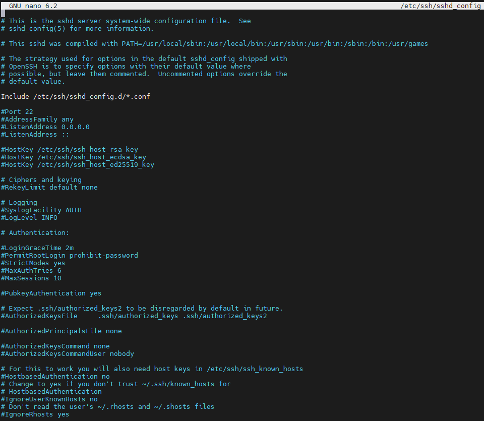
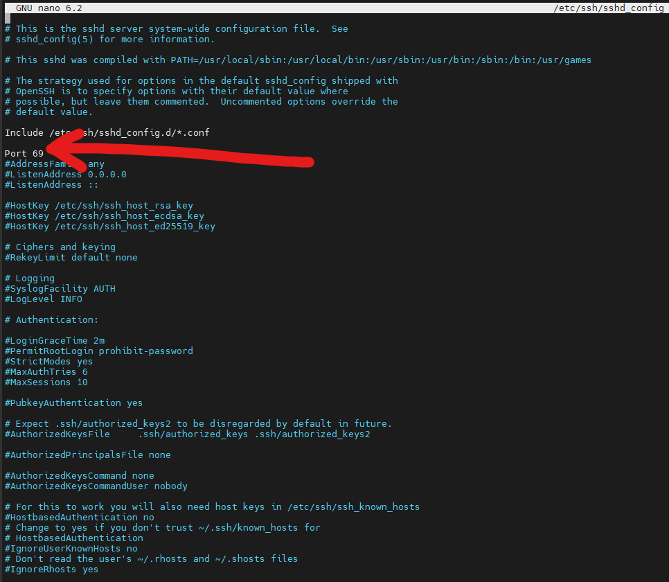
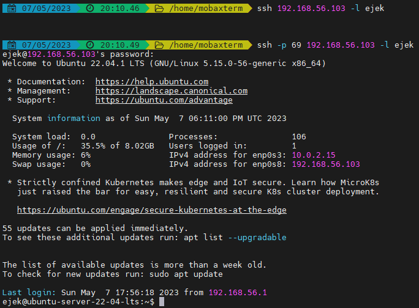
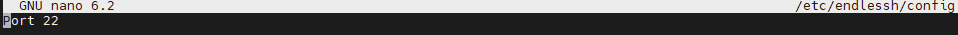

# BECYB - Endless SSH poc

## 1. Prepare the environment

I've just created the ubuntu server virtual machine in VirtualBox.

TODO rysunek architektury tego here

## 2. Change default OpenSSH port

The OpenSSH client is included in Ubuntu by default. And the default port is 22.

### 2.1 Check the current OpenSSH port

```sh
sudo netstat -tulnp | grep ssh
```


### 2.2 Open OpenSSH configuration file

```sh
sudo nano /etc/ssh/sshd_config
```



### 2.3 Change the OpenSSH configuration file content



Only one line requires the change. Uncomment the Port line and replace the default value with your desired one.

Save the file.

### 2.4 Restart the OpenSSH deamon

```sh
sudo systemctl restart sshd
```

### 2.5 Check the current OpenSSH port again

```sh
sudo netstat -tulnp | grep ssh
```


### 2.6 Final notes

Note that now you'll need to specify the port to connect to the machine, since the value is no longer the default one.



## 3. Install and run Endless SSH

### 3.1 Clone the github repo

```sh
cd ~
git clone https://github.com/skeeto/endlessh.git
```

### 3.2 Build the binaries

You may need to install `make` or `gcc` first.

```sh
sudo apt update
sudo apt upgrade
sudo apt install libc6-dev
cd ~/endlessh
make
```

### 3.3. Move the binary to your PATH folder

```sh
echo $PATH
cd ~/endlessh
sudo mv endlessh /usr/local/bin/
```

Check if it is there

```sh
which endlessh
```

### 3.4 Copy the endlessh.service file to the appriopriate dir

```sh
cd ~/endlessh
sudo cp util/endlessh.service /etc/systemd/system/
```

### 3.5 Enable systemctl endlessh service

```
sudo systemctl enable endlessh
```

### 3.6 Create the config file for endlessh

```sh
sudo mkdir -p /etc/endlessh
sudo nano /etc/endlessh/config
```



You only need to specify the port.

### 3.7 Run the systemctl endlessh service

```sh
sudo systemctl start endlessh
```

Make sure the systemctl service is running:

```sh
sudo systemctl | grep endlessh
```

```sh
sudo systemctl status endlessh.service
```

Make sure its running on the correct port:

```sh
sudo netstat -tulpn | grep endlessh
```

### 3.8 Enable running on ports < 1024

Go to file and read the comment starting with line `## If you want Endlessh to bind on ports < 1024`

```sh
sudo nano /etc/systemd/system/endlessh.service
sudo setcap 'cap_net_bind_service=+ep' /usr/local/bin/endlessh
sudo reboot
```

### 3.10 Check if the systemctl service is running

Make sure the systemctl service is running:

```sh
sudo systemctl | grep endlessh
```

```sh
sudo systemctl status endlessh.service
```

Make sure its running on the correct port:

```sh
sudo netstat -tulpn | grep endlessh
```


